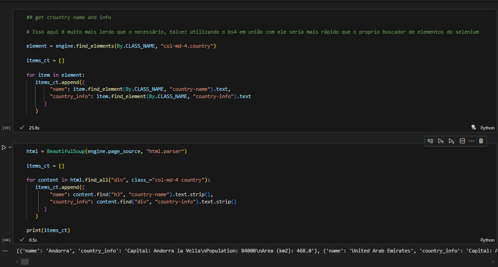

# Selenium - Notas de aprendizado

Esse md é dedicado à notas relacionadas ao Selenium.
Durante os estudos decorrentes daqui, será relatado dúvidas, ideias,
interesses e tudo mais. **Nem todas as informações aqui presente estarão corretas**,
aqui é apenas para consolidar algumas ideias sobre a ferramenta durante meus estudos.

## Notas e relatórios
A partir da versão 4 do selenium, não é mais necessário baixar os webdrivers manualmente.

Obtive problemas com a opção de sandbox usando o chrome, para resolver precisei usar o ChromeOptions
e adicionar uma opção usando add_argument("--no-sandbox").

o objeto driver criado herdando as funções da chamada do navegador, é literalmente o navegador. Por ele é possível realizar e pegar informações do navegador como tamanho, localização ou até mesmo aumentar e diminuir o tamanho.

se eu criasse um servidor dedicado apenas para renderizar páginas web e retornasse para os clientes por meio de uma API,
isso claramente e com toda certeza facilitaria o processo e agilizaria todo o resto.

## Conceitos interessante para estudar depois ou durante o desenvolvimento das skills

* Saber mais sobre doom e inspetor de elementos
* Descobrir formas de otimizar o selenium 

# Interesses básicos

* quais as configurações básicas do core do selenium? Opções de navegadores no geral.
* como faço pra abrir um site? Usando a função GET na variável onde está o driver aberto.
* como faço uma simples raspagem com o selenium? usando a função find_element, mas no geral é muito lento sua busca.

# testes e curiosidades
* implementar o selenium, beautifulsoup e requests daria algum ganho? SIm, com toda certeza.

* utilizar cython ao invés do python daria algum resultado? Provavelmente não, teria que ter algo relacionado a mudanças
no código do selenium. Talvez em códigos seus complexos mas no geral não teria um grande ganho.

# Missão final
* Tentar construir um kit de ferramentas interessantes para integrar ao ambiente
de desenvolvimento usando selenium, por exemplo, usar o poder do selenium com requests e bs4,
um kit de desenvolvimento.
